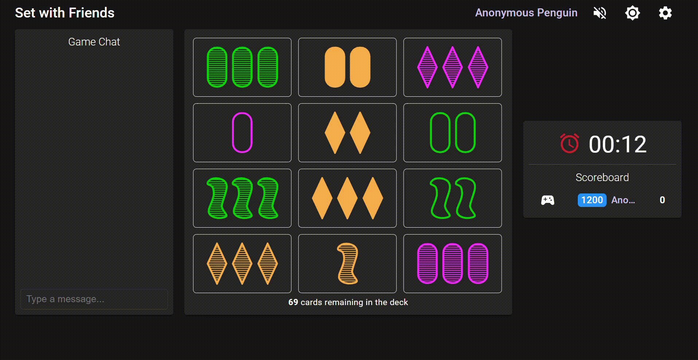

# Autoset

## Keywords

object detection, template matching, opencv, python

## Demo

## How to use

1. Clone repo and have python and the neccessary packages imported (cv2, numpy, time, win32gui, mss, os, keyboard)
2. Open Chrome and go to [setwithfriends.com](https://setwithfriends.com/)
3. Set dark mode and zoom into 150% (this might vary on different screen sizes)
4. Start a new game and run experiment_set.py

## About the development process

During the pandemic, a good friend of mine and I used to play [Set](https://en.wikipedia.org/wiki/Set_(card_game)). We had lots of fun and I thought the rules are simple, mechanical steps have to be repeated over and over again (however, quite a challange to a human). The game is based on visual perception, so this makes it a perfect candidate to a simple project that helps me to learn image processing in practice.

1. First step was to get hold of the image data from the browser. So I looked for a python package that can capture the screen (mss) and another package (win32gui) that can command Windows OS to set focus on the browser before making the screenshot

2. Next step was to identify the cards on the screenshot. For this task, after a little research on object detection, I chose template matching over feature matching, as the orientation, size, etc. is always the same, and I felt like feature matching would have been a bit overkill. 

The "brute force" method is to run template matching of all the cards (81 total) against the input image, but that would have required 81 template matching method calls involving the original image, and I would have had to prepare all the unique cards manually. So I decided I could use a mask to find all the card locations, masking the inner region of a card. This way, I was matching the frame of a card against the original image. Slicing these locations from the original image, I had the cards cropped out in a collection. Now I had to identify these cards, template matching the unique feature (color, pattern, shape) of each card against the collection. Depending on the results, I could determine how many unique feature was on a given card, and thus, identifying the card.

In this step I've encountered the problem that if threshold was too high, then template matching wouldn't find all the objects, if too low, it would find the same object multiple times. So I increased threshold to a point where all objects were surely found, and removed duplicate results.

3. Knowing which cards are on screen, we can now find the sets. A set is when three card is found, where the four attributes (color, pattern, shape, count) of each card is either the same or either all different. For this, python's implementation of the mathematical set (without multiplicities) came handy.

4. Finally, the corresponding cards are selected with virtual keyboard commands.

## Further experimenting

I'd like to try to use feature matching instead of template matching to see how the two compares in speed, sensitivity to card size, card orientation.
